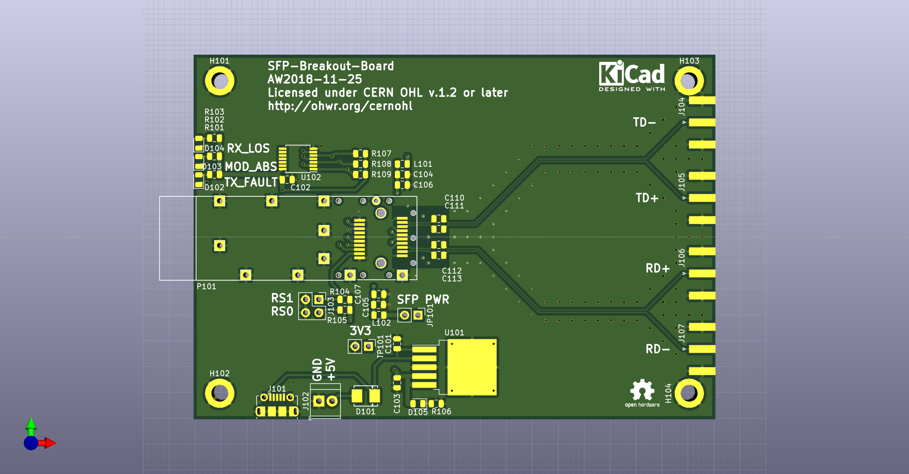

# SFP-Breakout-Board
SFP fibre-optical transciever simple breakout board. Works up to at least 1 Gbit/s.

* differential TX+/TX- RX+/RX- outputs/inputs with SMA connectors
* connector and cage for SFP or SFP+ transciever
* +3V3 power for transciever
* Three status LEDs for TX_FAULT, LOS, and MOD_ABS
* jumpers for SFP rate-select settings.

See also these other similar projects:

* https://github.com/aewallin/SFP2SMA_2018.03  single-ended input/output, with op-amp and transformer coupling to SFP
* https://osmocom.org/projects/misc-hardware/wiki/Sfp-experimenter
* https://osmocom.org/projects/misc-hardware/wiki/Sfp-breakout
* Multi-SFP crate https://www.ohwr.org/project/sfp-plus-i2c/wikis/home
